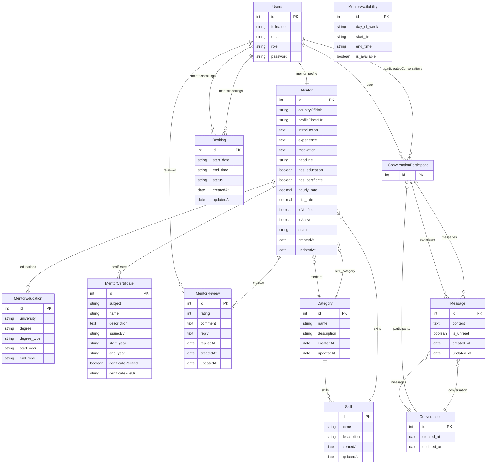

# ER Diagram for SattaPatta Application

The following ER diagram represents the data model of the SattaPatta application based on TypeORM entities.

## Entity Relationships Explanation

1. **Users**
   - One User can have one Mentor profile (OneToOne)
   - One User can have many Bookings as a mentor (OneToMany)
   - One User can have many Bookings as a mentee (OneToMany)
   - One User can participate in many Conversations (OneToMany to ConversationParticipant)

2. **Mentor**
   - One Mentor belongs to one User (OneToOne)
   - One Mentor can have many Education records (OneToMany)
   - One Mentor can have many Certificate records (OneToMany)
   - One Mentor can have many Reviews (OneToMany)
   - One Mentor belongs to one Category (ManyToOne)
   - One Mentor can have many Skills (ManyToOne/ManyToMany)

3. **Category**
   - One Category can have many Skills (OneToMany)
   - One Category can have many Mentors (OneToMany)

4. **Skill**
   - One Skill belongs to one Category (ManyToOne)
   - One Skill can be associated with many Mentors (ManyToMany)

5. **Booking**
   - One Booking has one mentor User (ManyToOne)
   - One Booking has one mentee User (ManyToOne)

6. **Conversation System**
   - One Conversation has many Participants (OneToMany)
   - One Conversation has many Messages (OneToMany)
   - One Participant belongs to one User (ManyToOne)
   - One Participant belongs to one Conversation (ManyToOne)
   - One Participant can have many Messages (OneToMany)
   - One Message belongs to one Conversation (ManyToOne)
   - One Message belongs to one Participant (ManyToOne)